# Purpose

We are building this MERN application(online retail store) to let our client sell his products online. The client deals in Chinese herbal medicine and currently he is using facebook to run his business but they don't have an official website.

# Functionality/Features

- User can inspect all the available listings for sale
- User can search for a particular product
- User can inspect the details of individial listings
- User can buy the listings via an online payment portal.
- User can cart multiple items and pay together.
- User can get in touch via a contact form
- User can visit the facebook page of the business via provided social link.
- Admin Dashboard
  - Admin can create a new listing
  - Admin can edit listings
  - Admin can delete listings
    OPTIONALS:
- User can sign up for and new account
- User can login with their existing account
- User can access his dashboard.
  - View past orders.
  - User can rate and review the product
- User can retrieve the password.

# Target audience

The target audience of this web application would be people with asian ethnicity who are comfortable using computers for their day to day activities like online shopping, entertainment etc.

# Tech stack

- MongoDB
- Express
- React
- Node.js
- GitHub
- Heroku to deploy backend
- netlify to deploy frontend
- Atlas to host the MongoDB database.
- Mockflow for wireframes
- LucidCharts for Dataflow diagram.
- Formspree for email service.

# Dataflow Diagram

# Application Architecture Diagram

# User Stories

# Wireframes

## DESKTOP

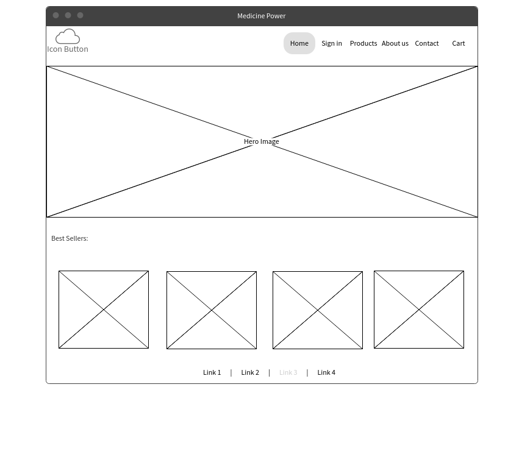
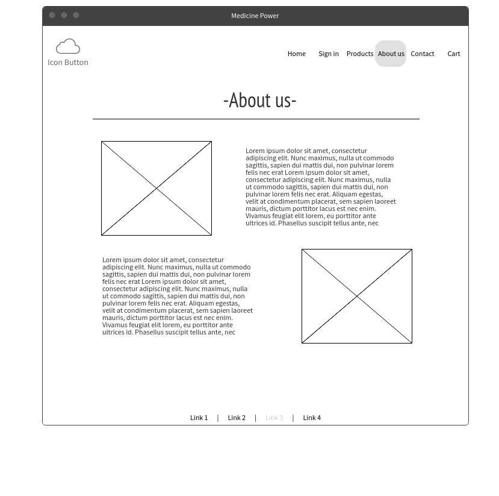

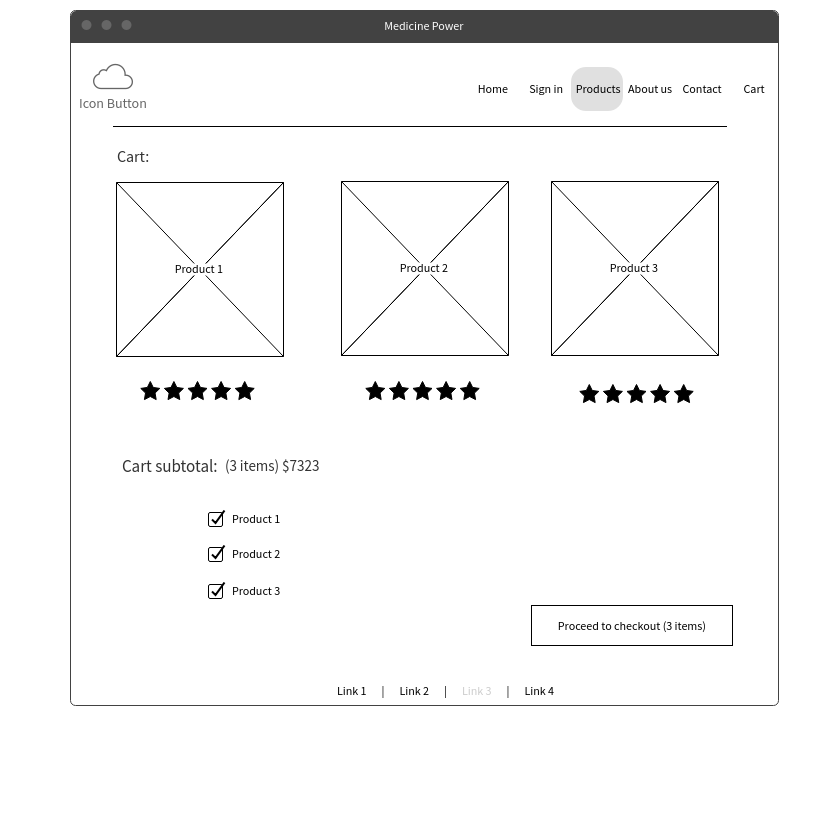

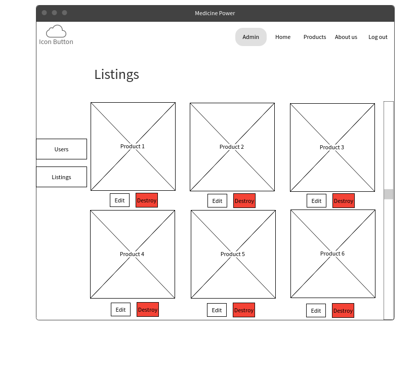
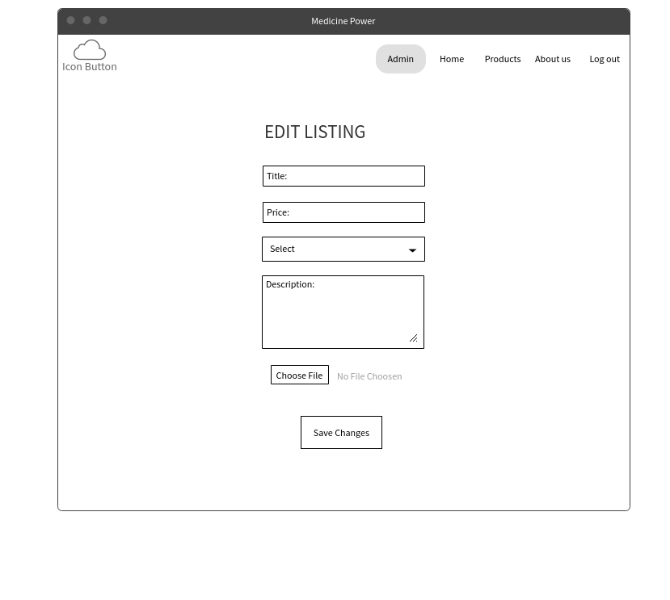

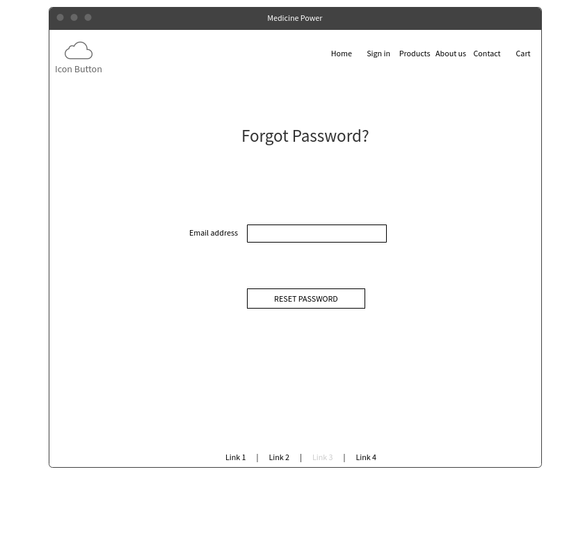

## MOBILE

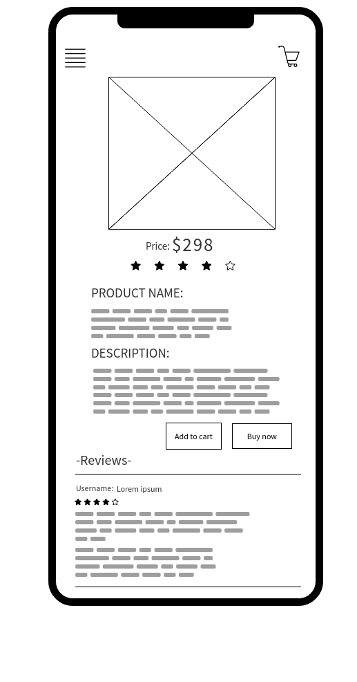

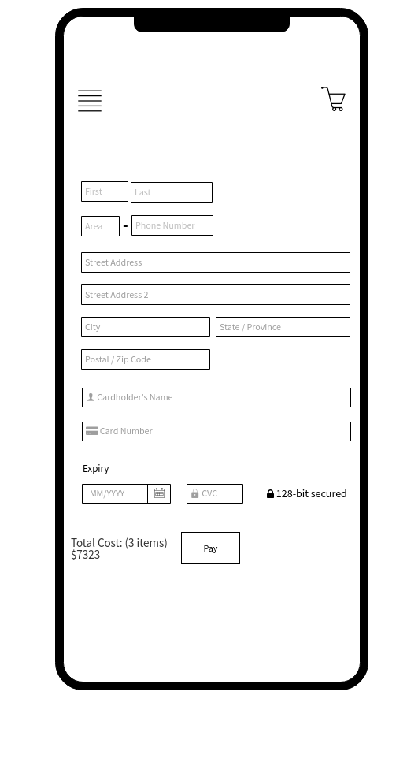

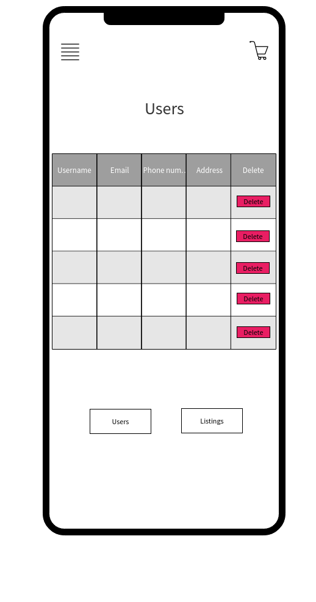
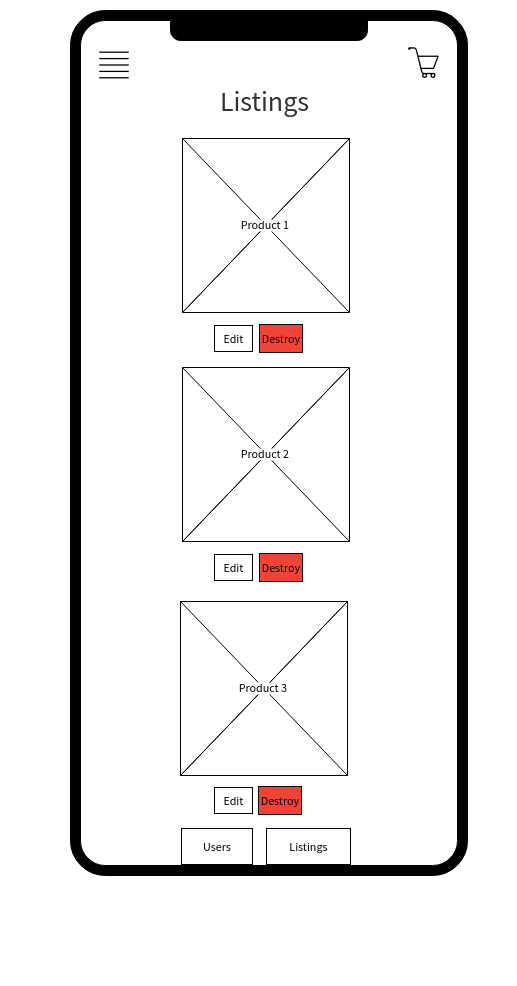
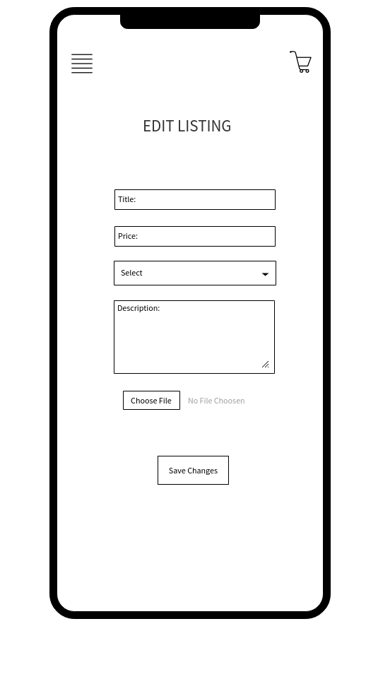

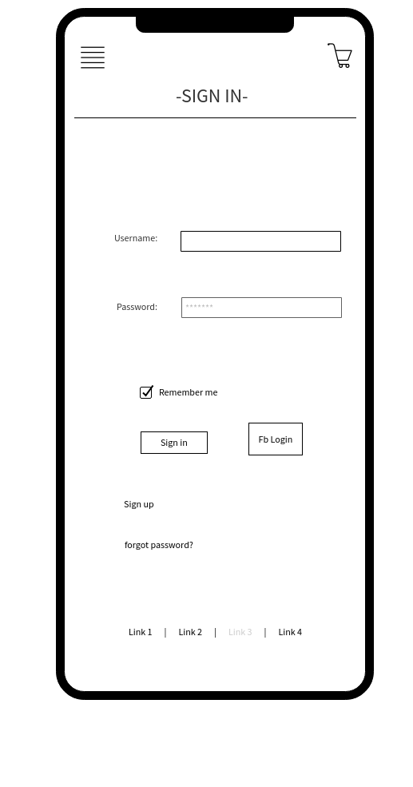

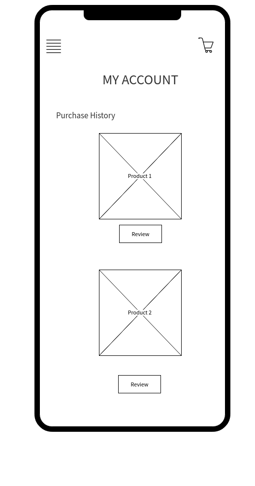

# Screenshots of your Trello board throughout the duration of the project

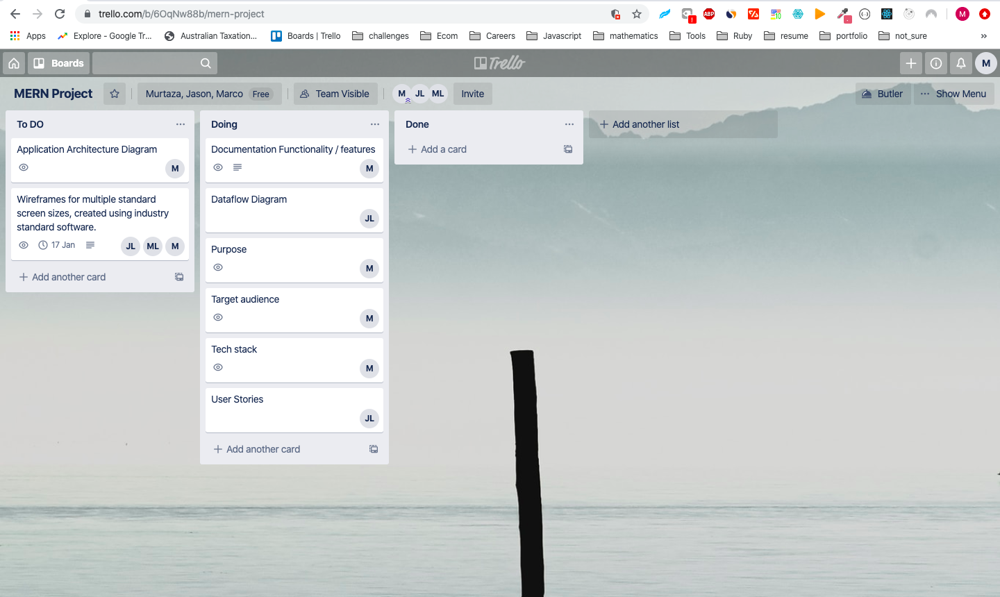
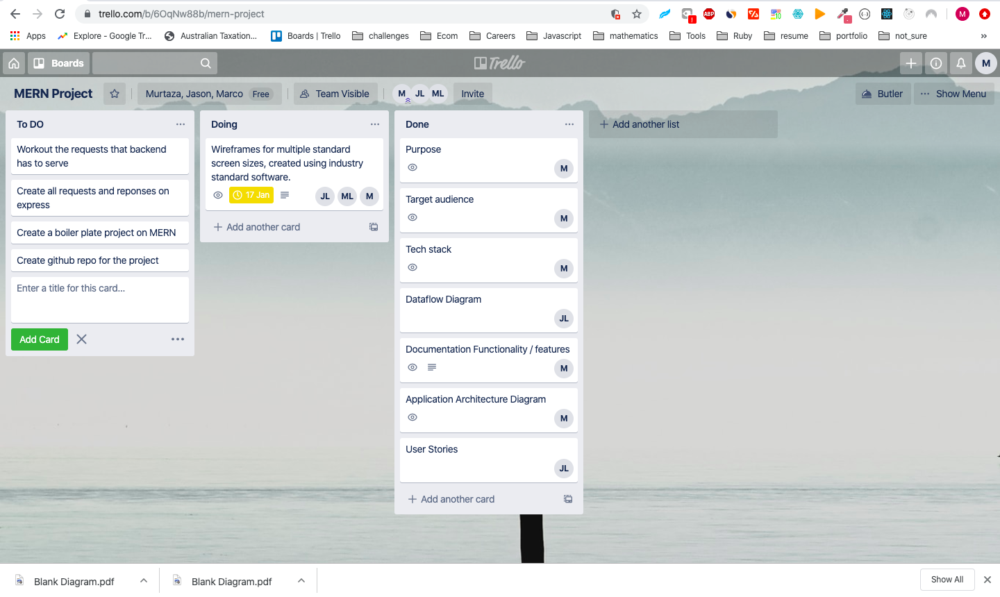

